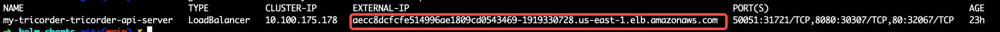

# Starship Helm charts

This repository contains Helm charts for deploying Starship Observability
platform, developed by [Tricorder Observability](https://tricorder.dev).

**WARNING:** This project is currently in active development. Consider everything
as technical preview only.

## Prerequisites

- Kubernetes 1.16+ [get started](https://kubernetes.io/docs/setup/)
- Helm 3+ [installation](https://helm.sh/docs/intro/install/)

TODO: Add instructions for other public Clouds.

### AWS EKS

- If you are using AWS EKS, isntall
  [EBS CSI](https://docs.aws.amazon.com/eks/latest/userguide/ebs-csi.html)
  on your EKS cluster.

  This is required because Helm charts create
  [PersistentVolume](https://kubernetes.io/docs/concepts/storage/persistent-volumes/)
  for database pods, which requires EBS CSI.
- You also need to install
  [AWS Load Balancer Controller](https://docs.aws.amazon.com/eks/latest/userguide/aws-load-balancer-controller.html)
  in order to use LoadBalancer service type, which is Starship's default service
  type.

## Install

**WARNING:** Do not try to install Starship simultaneously into multiple
namespaces. That won't work because of system limitations.
If you accidentally did that, follow the [uninstall](#uninstall) instructions
to remove all artifacts and reinstall.

Change namespace to your own, here we use `tricorder` as an example.

```shell
helm repo add tricorder-stable \
    https://tricorder-observability.github.io/helm-charts
helm repo update
kubectl create namespace tricorder
helm install my-starship tricorder-stable/starship -n tricorder
```

**Optional:** [Send OpenTelemetry data to Starship](./docs/send-otlp-data-to-starship.md).

As usual, you can override configuration values defined in `Values.yaml`
with `--set` flags.

### Override default values

```shell
# Change service type to ClusterIP
helm upgrade my-starship tricorder-stable/starship -n tricorder \
    --set service.type=ClusterIP

# Use specified container image tag
helm upgrade my-starship tricorder-stable/starship -n tricorder \
    --set tag=<a specific tag>
```

## Install from local repo

`git clone` this repo repo, and replace `tricorder-stable/starship` with the
charts local path `charts/starship`.

```shell
git clone git@github.com:tricorder-observability/helm-charts.git
cd helm-charts
# You'll need this step to fetch the dependent charts
helm dep update charts/starship
helm install my-starship charts/starship -n tricorder
```

All commands listed in the previous [install](#install) section works when you
swap `tricorder-stable/starship` with `charts/starship` when the PWD is the
root of the repo.

## Expose Starship managenment UI with `kubectl port-forward`

Starship will need the services exposed outside of the Kubernetes cluster in
order to use them. You can expose the services to your local system using the
`kubectl port-forward` command or by configuring service types (ie:
LoadBalancer) with optionally deployed ingress resources.

To expose the Starship managenment UI service use the following command (replace
`my-starship-api-server` and `-n tricorder` with your Helm chart release name
accordingly):

```shell
kubectl -n tricorder port-forward service/my-starship-api-server 18080:80
```

With the Starship managenment UI set up, you can access:

Starship managenment UI: <http://localhost:18080/>

## Expose Starship managenment UI with Load Balancer

Using the following command to change service type to LoadBalancer,
and if your cluster has configured LoadBalancer that supports external access,
like AWS LoadBalancer Controller,
you will be able to get an external-ip to access the service directly:

```shell
helm upgrade my-starship tricorder-stable/starship -n tricorder --set apiServer.service.type=LoadBalancer
kubectl get svc -n tricorder my-starship-tricorder-api-server
```



Navigate to `http://${External-IP}` in your browser, be sure to note that
the protocol is http, not https

## Data Retention

Metric and Trace data has an automated retention that drops data after a certain
age. The default retention is 7 days:

```yaml
promscale:
  config:
    startup.dataset.config: |
      metrics:
        compress_data: true
        default_retention_period: 7d
      traces:
        default_retention_period: 7d
```

and above retention can be customized by `--values` flag, We can change
`default_retention_period`'s value from `7 days` to `30 days`:

- create patch yaml file for custom values:

```shell
cat > rentention_patch.yaml << EOF
promscale:
  config:
    startup.dataset.config: |
      metrics:
        compress_data: true
        default_retention_period: 30d
      traces:
        default_retention_period: 30d
EOF
```

- override default settings by `--values` flag:

```shell
helm install my-starship tricorder-stable/starship -n tricorder \
    --values rentention_patch.yaml
```

## Uninstall

To uninstall a release you can run:

```shell
helm uninstall my-starship -n tricorder
```

After uninstalling helm release some objects will be left over. To remove them
follow next sections.

### Cleanup secrets

Secret's created with the deployment aren't deleted. These secrets need to be
manually deleted:

```shell
kubectl delete -n tricorder \
    $(kubectl get secrets -n tricorder -l "app=timescaledb" -o name)
```

### Cleanup configmap

```shell
kubectl delete -n tricorder \
    $(kubectl get configmap -n tricorder -l "app=my-starship-promscale" -o name)
```

### Cleanup Kube-Prometheus secret

One of the Kube-Prometheus secrets created with the deployment isn't deleted.
This secret needs to be manually deleted:

```shell
kubectl delete secret -n tricorder my-starship-kube-prometheus-stack-admission
```

### Cleanup DB PVCs and Backup

Removing the deployment does not remove the Persistent Volume Claims (pvc)
belonging to the release. For a full cleanup run:

```shell
kubectl delete -n tricorder \
    $(kubectl get pvc -n tricorder -l release=my-starship -o name)
```

### Prometheus PVCs

Removing the deployment does not remove the Persistent Volume Claims (pvc) of
Prometheus belonging to the release. For a full cleanup run:

```shell
kubectl delete -n tricorder $(kubectl get pvc -n tricorder \
  -l operator.prometheus.io/name=my-starship-kube-prometheus-stack-prometheus \
  -o name)
```

### Prometheus CRDs, ValidatingWebhookConfiguration and MutatingWebhookConfiguration

```shell
kubectl delete crd alertmanagerconfigs.monitoring.coreos.com \
    alertmanagers.monitoring.coreos.com \
    probes.monitoring.coreos.com \
    prometheuses.monitoring.coreos.com \
    prometheusrules.monitoring.coreos.com \
    servicemonitors.monitoring.coreos.com \
    thanosrulers.monitoring.coreos.com \
    podmonitors.monitoring.coreos.com
```

```shell
kubectl delete MutatingWebhookConfiguration my-starship-kube-promethe-admission
kubectl delete ValidatingWebhookConfiguration my-starship-kube-prometheus-admission
```

### Delete Namespace

```shell
kubectl delete namespace tricorder
```
